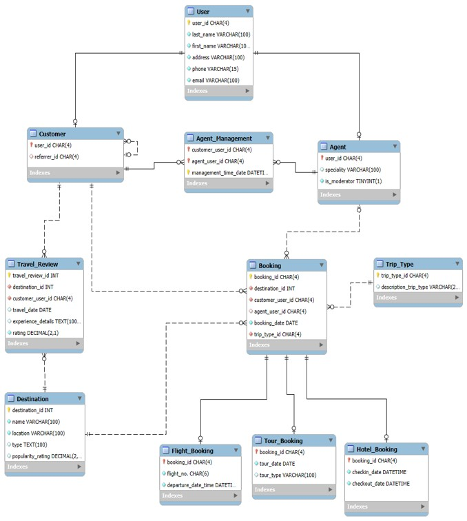

# Community Driven Travel Booking Database

A relational database project designed to manage travel bookings, customers, agents, destinations, trip types, and customer travel reviews.

## Project Overview

The **Community Driven Travel Booking Database** supports a travel booking environment where customers can make bookings, receive assistance from agents, select different types of trips, and share their travel experiences through reviews.

The database demonstrates core relational database concepts including:

- Primary keys and foreign keys
- Supertype/subtype relationships
- Associative entities
- Recursive relationships
- Optional relationships
- Referential integrity
- Inner joins and outer joins
- Aggregation and grouping
- Filtering with `HAVING`
- Ordering and analytical queries

## Database Design

The database uses **User** as a supertype, with **Customer** and **Agent** as subtypes. A user can participate in the system as a customer, an agent, or both.

The **Booking** entity is the main transaction table and connects customers with destinations, trip types, and optionally an assisting agent.

Specialized booking subtypes are used for:

- **Flight_Booking**
- **Tour_Booking**
- **Hotel_Booking**

Each subtype uses `booking_id` as both its primary key and foreign key to the main Booking table.

The **Agent_Management** table resolves the many-to-many relationship between agents and customers, while **Travel_Review** stores customer feedback, travel dates, experience details, and ratings.

A recursive relationship is also modeled through `Customer.referrer_id`, allowing one customer to refer another.

## ER Diagram

## SQL Analysis

This project includes five SQL queries:

### 1. Destinations with an average rating above 4.3

Calculates the average customer rating for each destination and returns only destinations with an average rating greater than 4.3.

### 2. Customer reviews for a selected destination

Uses joins between **User**, **Customer**, **Travel_Review**, and **Destination** to retrieve customer names, review details, and ratings for a specific destination.

### 3. Number of bookings managed by each agent

Counts the bookings handled by each agent and groups the results by agent.

### 4. Bookings and agent specialties

Uses a **LEFT JOIN** so every booking appears even when no agent is associated with the booking.

### 5. Popular destinations by selected trip type

Retrieves destinations suitable for Weekend Trips and Long Trips, along with popularity ratings and booking counts.

## Key Findings

- Kyoto Imperial Palace and Virginia Beach had average review ratings above 4.3 in the sample query results.
- Some bookings were completed without an assisting agent, demonstrating the optional agent relationship in the Booking table.
- Agent booking counts can be aggregated to analyze agent workload.
- Grand Canyon had the highest booking count among the destinations returned in the Weekend Trip and Long Trip analysis.

## Technologies Used

- MySQL
- MySQL Workbench
- SQL
- Relational Database Design
- EER Modeling

## Repository Files

- `queries.sql` — SQL queries used for analysis
- `ERD_CommunityDriven_Travel_Database.jpg` — database EER diagram
- `Community Driven Travel Booking Database PROJECT.docx` — project report
- `Data.xlsx` — project data

## Skills Demonstrated

SQL • MySQL • Database Design • Data Modeling • EER Diagrams • Joins • Aggregation • GROUP BY • HAVING • LEFT JOIN • Relational Databases
